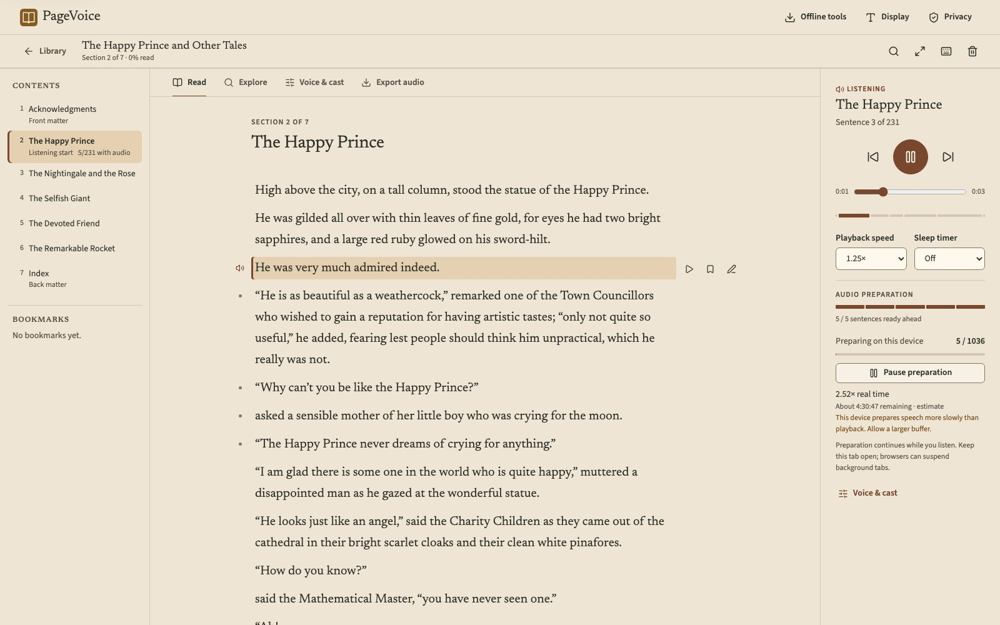

# PageVoice

PageVoice is a reading and accessibility app for PDFs and EPUBs. Import a document,
read it, listen to it with a neural voice that runs in your browser, and search it.

**Website:** <https://pagevoice.tech> · **App:** <https://pagevoice.tech/app/>



PageVoice is a static progressive web app. There is no backend, account, API key or
database: documents are parsed, narrated, searched and stored inside the browser.

## Features

**Reading**

- Library with covers, author, format, page or section count, reading progress and
  last-opened time; sort, filter and "Continue reading"
- Paper, light and night themes; text size (16–32 px) and line width settings
- Contents drawer, previous/next section, bookmarks, focus mode
- Find in book (`/` or `Ctrl`/`⌘ F`): case- and accent-insensitive, highlights every
  match, `Enter`/`Shift Enter` to step through results
- Reading position is saved while you scroll or listen

**Listening**

- Kokoro (English) and Piper DaveFX/Sharvard (Spain Spanish) run locally in a Web
  Worker after a one-time download; Supertonic 2 is an experimental comparison engine
- The sentence being spoken is highlighted and scrolled into view
- Play/pause, previous/next sentence, playback speed 0.5–2×, sleep timer, media keys
- Audio is prepared ahead of the listening position; the buffer size is adjustable
- Export prepared chapters as an MP3 ZIP (with metadata and citations) or, best
  effort, as an M4B via single-threaded FFmpeg WASM
- Device speech (`speechSynthesis`) is available as an explicit fallback

**Understanding**

- Keyword search across the book with section citations, "Show in source" and
  "Listen from here"
- Detected sections (chapters, front and back matter) with confidence, reasons and
  manual correction
- Optional local meaning search (multilingual MiniLM embeddings) and character-name
  detection (multilingual NER), each an opt-in download
- No language model generates summaries or answers; every result is a passage from
  the document

**Accessibility**

- Keyboard operable throughout, with visible focus and documented shortcuts
  (`Space`, `/`, `J`/`K`, `←`/`→`, `F`, `Esc`, `?`)
- Semantic landmarks, labelled controls, tab/tabpanel semantics and live status
  regions; dialogs use native `<dialog>` with focus return
- The spoken sentence is marked by an inset bar and an icon as well as colour
- `prefers-reduced-motion` and `prefers-color-scheme` are respected
- Interface in English and Spanish, independent of the document's language

## Supported formats

| Format | Notes |
| --- | --- |
| EPUB 2 / 3 | Chapters, metadata and cover. DRM-protected or encrypted books are rejected. |
| PDF with a text layer | Sections from bookmarks and headings; repeated headers, footers and page numbers are removed and listed as review notes. |
| Scanned PDF | Needs the optional English + Spanish OCR download (Tesseract). Multi-column or damaged scans may not be reconstructed well. |

Files up to 100 MB. Language (English or Spanish) is detected automatically and can be
corrected in **Voice & cast**. Other languages are not supported for narration.

## Architecture

```
web/
  index.html          Public introduction page (static HTML)
  app/index.html      The reader application (React)
  404.html            Not-found page
  src/App.jsx         App shell, library, import feedback, dialogs
  src/ui/             Reader, player, library, display menu, find-in-book
  src/browser/        Parsing (pdf.js, JSZip, xmldom), sentences, language
                      detection, section analysis, keyword search
  src/offline/        Storage, model assets, speech engines, playback, workers
  src/styles/         Design tokens shared by the app and the introduction page
```

- **React 19 + Vite 8.** The reader route is code-split; the startup bundle holds
  the library and shell only.
- **Web Workers** do all heavy work: `reader.worker` (parsing, OCR, analysis, search
  index), `engine.worker` (Kokoro via kokoro-js, Piper via piper-wasm, Supertonic via
  ONNX Runtime Web; WASM by default, WebGPU optional for Kokoro), `knowledge.worker`
  (Transformers.js embeddings and NER), `search.worker` and `export.worker` (lamejs,
  FFmpeg WASM).
- **Storage.** IndexedDB holds documents, analysis and preferences; generated
  sentence audio is stored in the origin private file system (OPFS) with an IndexedDB
  fallback. Model files are cached by the service worker after hash verification.
- **PWA.** `vite-plugin-pwa` precaches the app shell, fonts and runtimes, prompts
  before updating, and serves `/app/` offline.

## Privacy and network use

What the implementation does:

- Documents, reading positions, bookmarks and generated audio are stored in this
  browser's storage on this device. Session-only imports are kept in memory.
- The app has no server component, accounts or analytics. Its code makes no request
  containing document text; the browser test suite asserts there are no non-GET or
  `/api` requests.
- Network requests are: loading the static site, and fixed, SHA-256-verified model
  and language-data downloads from Hugging Face and jsDelivr when the user chooses to
  download them. The Content Security Policy restricts `connect-src` to those hosts.
- **Exception:** device speech uses the operating system's voices, and some platforms
  process that speech with online services outside PageVoice's control. It is labelled
  where it is chosen and is never selected automatically.
- Browser storage can be evicted. **Protect local storage** requests persistence, and
  the library can be exported as a ZIP backup.

## Offline engines and download sizes

Sizes are decimal MB for a cold cache, including that engine's runtime.

| Tool | First download | License / limitation |
| --- | ---: | --- |
| Kokoro English, WASM q8 | 118.2 MB | Apache-2.0 model; English phonemizer only |
| Kokoro English, WebGPU fp32 | 362.5 MB | Optional GPU path; browser/adapter support varies |
| Piper DaveFX, Spain Spanish | 96.3 MB | MIT repository, CC0 dataset; GPL phonemizer |
| Piper Sharvard, Spain Spanish, 2 speakers | 109.8 MB | MIT repository, CC-BY-3.0 corpus; GPL phonemizer |
| Supertonic 2, experimental EN/ES | 278.2 MB | OpenRAIL-M restrictions; archived upstream |
| English + Spanish OCR | 25.4 MB | Apache-2.0 |
| Multilingual meaning search | 157.0 MB | Apache-2.0; inferred similarity, not evidence of an answer |
| Multilingual NER | 203.1 MB | AFL-3.0; news-domain model, fiction accuracy unmeasured |
| FFmpeg M4B | 32.3 MB | GPL/LGPL components; memory-limited browser export |

Full credits and licenses are in **Privacy & credits** in the app,
[web/LICENSES](web/LICENSES) and `/licenses/credits.html`. The original PageVoice code
is MIT licensed; third-party runtime and model licenses differ.

## Browser requirements

A current Chrome, Edge, Firefox or Safari with WebAssembly, Web Workers, IndexedDB
and ES modules. OPFS is used when available. WebGPU is optional (Kokoro GPU only).
Service workers, OPFS and WebGPU need HTTPS or `localhost`. Phones can run the voices,
but memory and storage quotas vary and preparation can be slower than real time;
the measured real-time factor is shown while preparing.

## Local development

Node **22.13.1** and npm **10.9.2** are the verified versions (see `.nvmrc`).

```sh
npm ci --prefix web
npm --prefix web run dev
```

- Introduction page: <http://127.0.0.1:5173/>
- App: <http://127.0.0.1:5173/app/>

The web app needs **no environment variables**. `.env.example` documents only the
optional Python power mode.

## Production build

```sh
npm --prefix web run build     # outputs web/dist
npm --prefix web run preview   # serves it on http://127.0.0.1:4173
```

The build copies pinned npm runtimes into static files. It does not download model
weights.

## Deployment

`vercel.json` deploys the static build from the repository root (Node 22, install
`npm ci --prefix web`, build `npm --prefix web run build`, output `web/dist`). It sets
security headers (CSP, HSTS, `nosniff`, frame denial, permissions policy), long-term
caching for hashed assets, revalidation for HTML and the service worker, a rewrite
for `/app/*`, and serves `404.html` for unknown paths. To use the custom domain, add
`pagevoice.tech` in the Vercel project's domain settings and point DNS at Vercel; the
canonical URLs, sitemap, robots file and social metadata already use
`https://pagevoice.tech`. See [static deployment](docs/static-deployment.md).

## Testing

```sh
npm --prefix web test            # unit and component tests (Vitest)
npm --prefix web run lint
npm --prefix web run format:check
npm --prefix web run build
# Browser tests. The first command downloads pinned model files for the
# speech tests; it is opt-in and not part of normal setup.
node web/scripts/cache-e2e-models.mjs
npm --prefix web run test:e2e
```

`web/scripts/capture-screenshots.mjs` regenerates the introduction-page screenshots
and social image from the real app (it downloads the Kokoro voice and plays real
narration). Earlier verification reports are in [docs](docs/static-verification.md).
No word-accuracy or subjective speech-quality benchmark has been performed.

## Limits

CPU narration may prepare slower than real time; browsers can suspend background
tabs, and a closed tab stops preparing. Exports cap loaded WAV data at 256 MB and
backup import caps uncompressed data at 512 MB. Optional analysis caps 12,000 passage
windows. OCR, dialogue attribution, language detection and section classification can
need correction. Highlighting follows sentences, not individual words.

## Optional Python power mode

The `pagevoice/` and `rag/` packages are a separate, optional local CLI/API with
FFmpeg, Tesseract and explicit-consent online Edge narration. The website never calls
them.

```sh
bash scripts/setup.sh
.venv/bin/pagevoice inspect book.epub --language es
.venv/bin/pagevoice convert book.epub --engine edge --language es --allow-network
.venv/bin/python -m pytest -q
```

See [Python power mode](docs/python-power-mode.md).

## License

MIT for the original PageVoice code. See [LICENSE](LICENSE) and the third-party
notices above.
