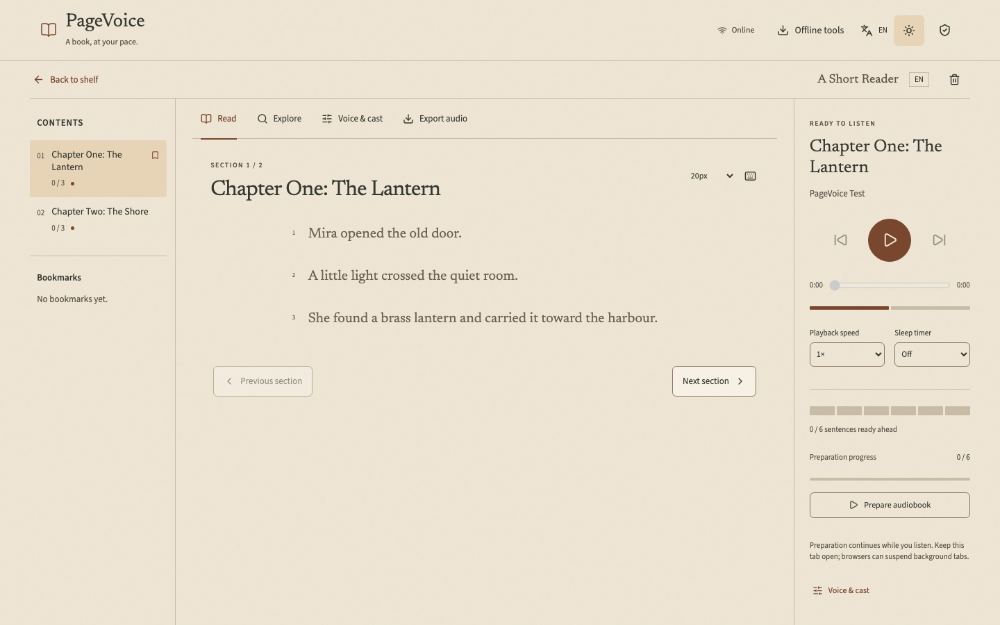

# PageVoice

Read and listen to English and Spanish PDFs and EPUBs in your browser.
The website is a **static offline PWA**. It needs no backend, account, API key,
PocketBase, or Edge service. Books never leave the browser.



## Run locally

Node **22.13.1** and npm **10.9.2** are the verified setup. Versions are pinned in
`web/package-lock.json`; Vercel uses Node 22. No Python setup is needed for the web app.

```sh
npm ci --prefix web && npm --prefix web run dev
```

Open http://127.0.0.1:5173. For the installable, offline production build:

```sh
npm --prefix web run build
npm --prefix web run preview
```

HTTPS or localhost is required for service workers, OPFS and WebGPU. The build
copies pinned npm runtimes to static files. It does not download model weights.

## Deploy on Vercel

Import this repository and select the repository root. `vercel.json` sets the
install/build commands and `web/dist` output. Choose Node 22. **No environment
variables are required.** Remove old `VITE_API_BASE_URL` and `VITE_POCKETBASE_URL`
settings; this frontend ignores them and has no server connection code.

Vercel serves HTML, JavaScript, fonts and WASM files only. Model/language downloads
are fixed, hash-verified GET requests to public static CDNs. No book text appears
in those requests. The website never calls `/api`, Microsoft TTS, or a database.
See [static deployment details](docs/static-deployment.md).

## Use the reader

1. Upload an EPUB or PDF, up to 100 MB. English/Spanish detection is automatic;
   mixed or short books may need the manual language correction in Voice & cast.
   EPUB chapters, metadata and covers are extracted. PDF bookmarks/headings supply
   sections; unstructured pages stay continuous. Review warnings describe removed
   repeating margins. Scanned PDFs need the optional English/Spanish OCR download.
2. **Keep in this browser** starts on. IndexedDB stores book/source/analysis records;
   OPFS stores sentence WAVs, with IndexedDB audio fallback. Turn the checkbox off
   for a session-only book. Each browser profile has its own shelf. People sharing
   one browser profile share that profile's shelf. Storage is not a cloud backup.
3. Open **Offline tools** and explicitly download the voice model you need. Progress,
   Pause/Resume, cached status and model removal are available. Completed files stay;
   partial downloads resume if the CDN supports ranges, otherwise that file restarts.
4. English uses Kokoro; Spain Spanish uses Piper DaveFX by default. Preview the
   selected voice. Pace and playback speed both range from 0.5 to 2×. Character
   attribution is inferred and reviewable; casting overrides are manual.
5. Click a sentence's **Listen from here**. Playback waits for 20 consecutive prepared
   sentences, or all remaining sentences for a shorter ending. The buffer can be
   changed. Preparation prioritizes that passage and later chapters, then fills the
   earlier chapters. Listening and preparation can be paused independently. If
   autoplay is blocked, tap **Tap to enable audio**.
6. Explore shows source-labelled structure, manual title/kind/start corrections,
   local keyword search and citations. Optional cached multilingual embeddings and
   NER add inferred matches/names. No LLM summaries or generated answers are offered.
7. Edit/regenerate just a changed sentence. Export prepared chapters as an **MP3 ZIP**
   with metadata and citations. **M4B** is best effort, using optional single-threaded
   FFmpeg WASM. Export one chapter at a time for larger books.

The shelf offers sorting, search, reading progress, storage usage, remove/8-second
Undo, Clear everything and ZIP library backup/import. A backup contains source
files and prepared audio; importing gives books new IDs. Saved audio and reading
positions survive refresh. Session-only books disappear on refresh. Removal stops
playback/preparation and purges the owned source, cover, analysis and audio.
Downloaded models remain until removed separately. Browser storage may be evicted;
use **Protect local storage** and export backups.

Light, sepia and dark themes, EN/ES interface language, text size, chapter drawer,
bookmarks, sleep timer, media-session controls and keyboard help are included.
Interface language is independent of book language. Sentence highlighting tracks
sentence audio files, not individual words.

## Offline engines and download sizes

Sizes below are decimal MB for a cold cache, including that engine's runtime.
Shared runtimes reduce later downloads. All inference runs in Web Workers.

| Tool | First download | License / limitation |
| --- | ---: | --- |
| Kokoro English, WASM q8 | 118.2 MB | Apache-2.0 model; English phonemizer only |
| Kokoro English, WebGPU fp32 | 362.5 MB | Optional GPU path; browser/adapter support varies |
| Piper DaveFX, Spain Spanish | 96.3 MB | MIT repository, CC0 dataset; GPL phonemizer |
| Piper Sharvard, Spain Spanish, 2 speakers | 109.8 MB | MIT repository, CC-BY-3.0 corpus; GPL phonemizer |
| Supertonic 2, experimental EN/ES | 278.2 MB | OpenRAIL-M restrictions; archived upstream |
| English + Spanish OCR | 25.4 MB | Apache-2.0 |
| Multilingual meaning search | 157.0 MB | Apache-2.0; inferred similarity, not evidence of an answer |
| Multilingual NER | 203.1 MB | AFL-3.0; news-domain model, fiction accuracy unmeasured |
| FFmpeg M4B | 32.3 MB | GPL/LGPL components; memory-limited browser export |

English voice styles are Heart, Bella, Michael, Adam, Emma, Isabella, George and
Daniel. Spanish offers DaveFX and Sharvard's two speaker IDs. Names, regions and
model metadata are shown; no age labels or unverified gender labels are invented.
Kokoro Spanish is not offered because kokoro-js's phonemizer here is English-only.

Supertonic 2 is a comparison engine, not the default. Measured runtime and signal
checks do not establish better pronunciation or naturalness. Device speech is an
explicit last-resort option: quality and offline availability depend on the OS,
and its voices may use cloud services outside PageVoice's control. Device speech
cannot produce downloadable audio.

Full model/runtime credits, licenses, source links and corpus attribution are in
**Credits & licenses**, [web/LICENSES](web/LICENSES), and the shipped static notices.
The original PageVoice code remains MIT; third-party runtime licenses differ.

## Verification and limits

```sh
npm --prefix web test
npm --prefix web run lint
npm --prefix web run format:check
npm --prefix web run build
# Downloads real pinned fixture models for the browser tests; opt-in, not setup.
node web/scripts/cache-e2e-models.mjs
npm --prefix web run test:e2e
```

The browser tests run real models, inspect non-silent WAVs and durations, export
MP3/M4B, reload saved data, remove/Undo and block the network after caching. The
[verification report](docs/static-verification.md) records commands, actual results,
RTF measurements, Lighthouse audits, screenshots and incomplete device coverage.
No word-accuracy or subjective speech-quality benchmark has been performed.

CPU Kokoro may prepare slower than real time. RTF and a rough ETA are shown on the
device. Browsers can suspend background tabs; a closed tab cannot keep preparing.
Memory and storage quotas vary, especially on phones. Exports cap loaded WAV data
at 256 MB; backup import caps uncompressed data at 512 MB. Optional analysis caps
12,000 short passages. OCR, dialogue attribution, language detection and section
classification can need correction. DRM/encrypted books and unsupported languages
are rejected. PDF OCR does not reconstruct every multi-column or damaged scan.

## Optional Python power mode

The `pagevoice/` and `rag/` implementations are unchanged. They remain an optional
local CLI/API with FFmpeg, Tesseract and explicit online Edge consent. This is
separate from the current website, which never calls them. Existing Python project
files remain on disk and are not migrated to browser storage.

```sh
bash scripts/setup.sh
.venv/bin/pagevoice inspect book.epub --language es
.venv/bin/pagevoice convert book.epub --engine edge --language es --allow-network
.venv/bin/python -m pytest -q
```

[Python power mode documentation](docs/python-power-mode.md) preserves the earlier
CLI/server instructions. Backend deployment documents are historical for the web
app; no backend host or domain is needed for this static release.
