# PageVoice browser-mode design

PageVoice is presented as a private reading room. The book and its reading
progress stay in the current tab; a small session notice keeps that limit
visible. Reader text is the main surface, and playback marks the sentence being
spoken while prepared sentences appear at full contrast. Controls remain quiet
so the book stays visually central.

## Tokens and type

The shared CSS custom properties keep the light and dark palettes aligned.
Titles and book text use locally bundled Newsreader; controls use locally
bundled Source Sans 3. Fonts are served from the build, with no font CDN.

| Token | Light | Dark |
| --- | --- | --- |
| `--paper` | `#f7f4ec` | `#101c24` |
| `--sheet` | `#fffdf8` | `#192932` |
| `--ink` | `#243239` | `#eee9dc` |
| `--accent` | `#855b20` | `#e7bd75` |
| `--line` | `#d1cdbf` | `#45545c` |

The compact spacing unit is 8 px and the common corner radius is 8 px. Status
colors are separate from the reading accent. The system preference chooses the
initial theme; the toolbar control changes it for the current preference.

## Components and behavior

- The library rail shows books, a typographic fallback cover and removal action.
- The reading surface shows section navigation, source text and sentence-level
  listening controls. Search results link back to their chapter and sentence.
- The audio panel selects an available browser voice, previews it and controls
  sentence-by-sentence speech and speed.
- The analysis panel exposes section labels, evidence and start-position review.
- Import and delete use labelled dialogs. Delete can be undone for eight seconds;
  the session can also be cleared explicitly.

Short opacity and transform transitions communicate dialog, toast and removal
state. The `prefers-reduced-motion: reduce` rule disables animation and
transitions. Visible focus rings, labelled controls, live progress messages,
keyboard shortcuts and mobile-sized controls are part of the component styles.

## Responsive screenshots

“Before” is the empty library from commit `3361a94`, captured locally with the
API unavailable. “After” is the browser-only empty library served by the live
Vercel site after PR #28. Each capture uses a 1000 px viewport height; the
responsive widths are 375, 768 and 1440 px.

### Light theme

| State | 375 px | 768 px | 1440 px |
| --- | --- | --- | --- |
| Before | 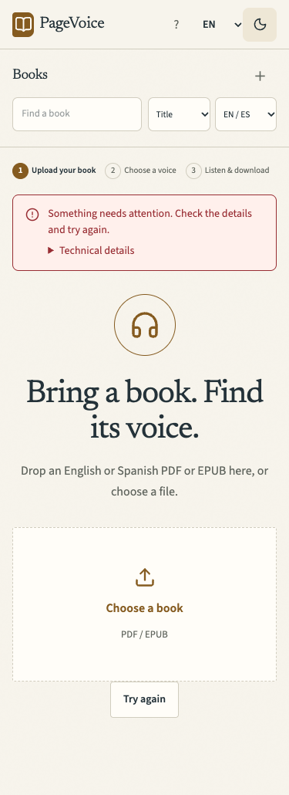 | 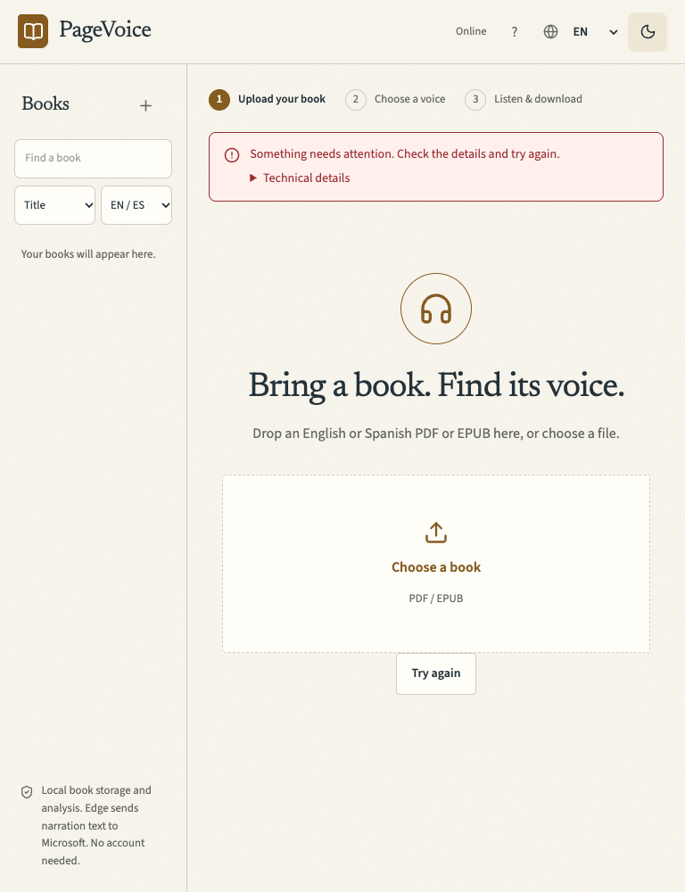 | 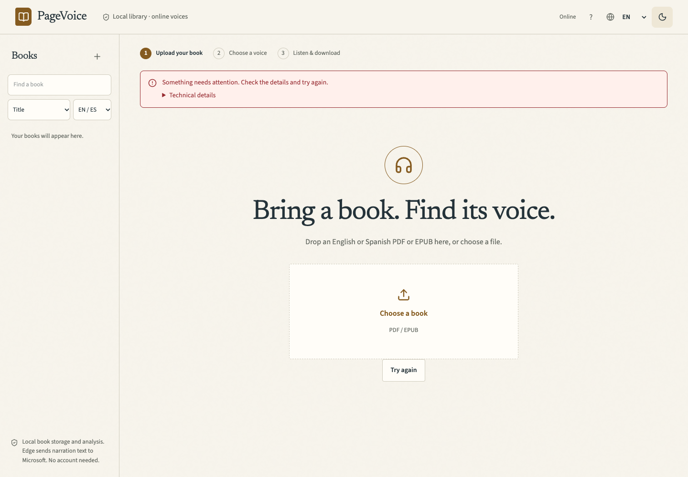 |
| After | 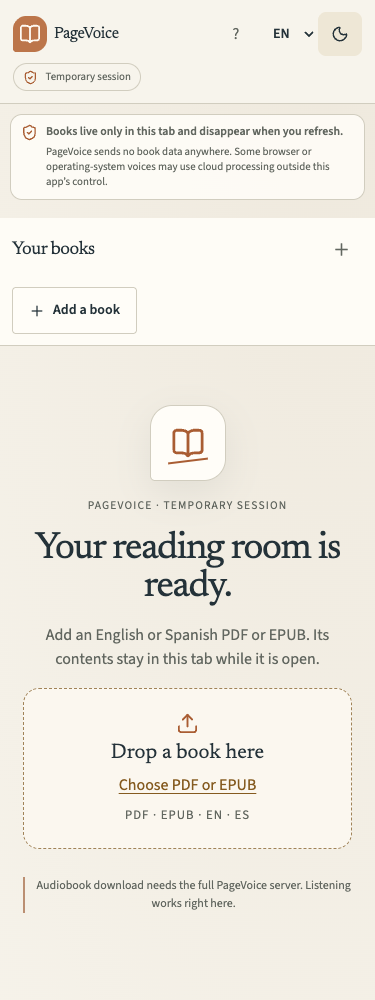 | 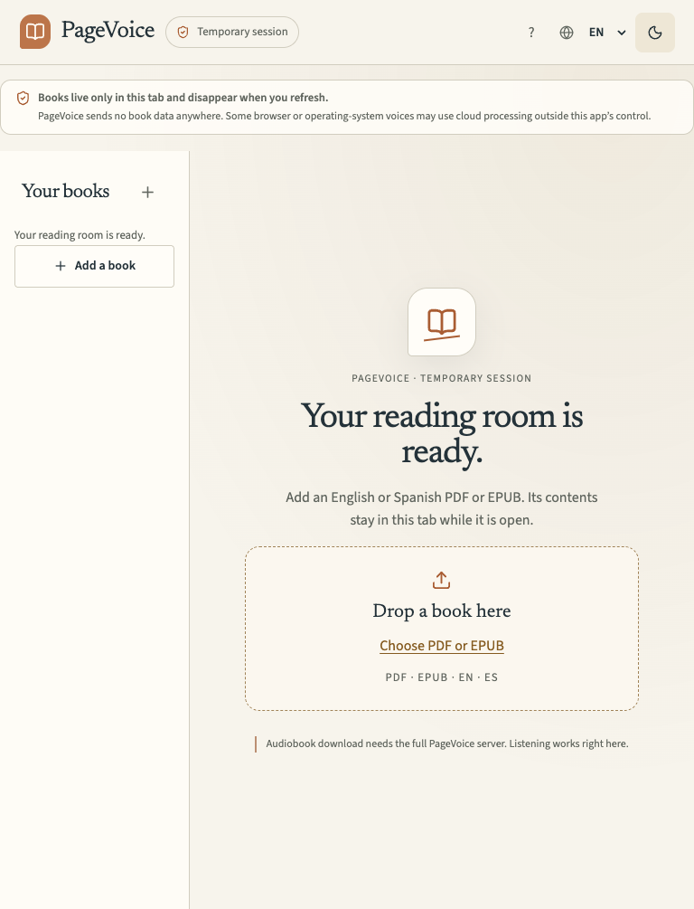 | 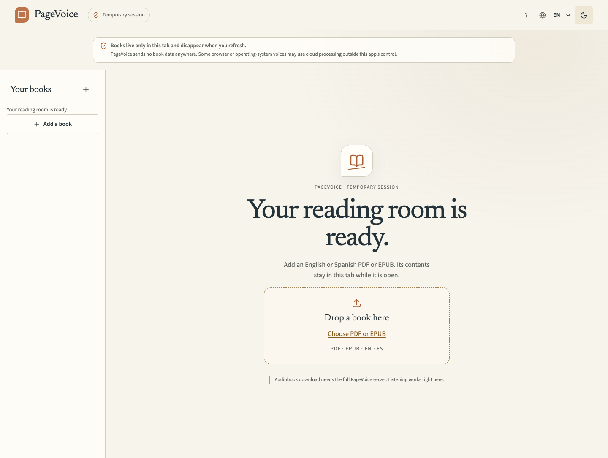 |

### Dark theme

| State | 375 px | 768 px | 1440 px |
| --- | --- | --- | --- |
| Before | 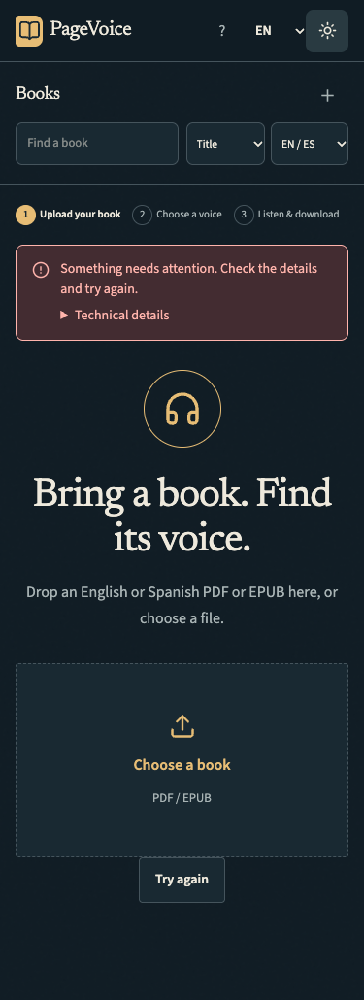 | 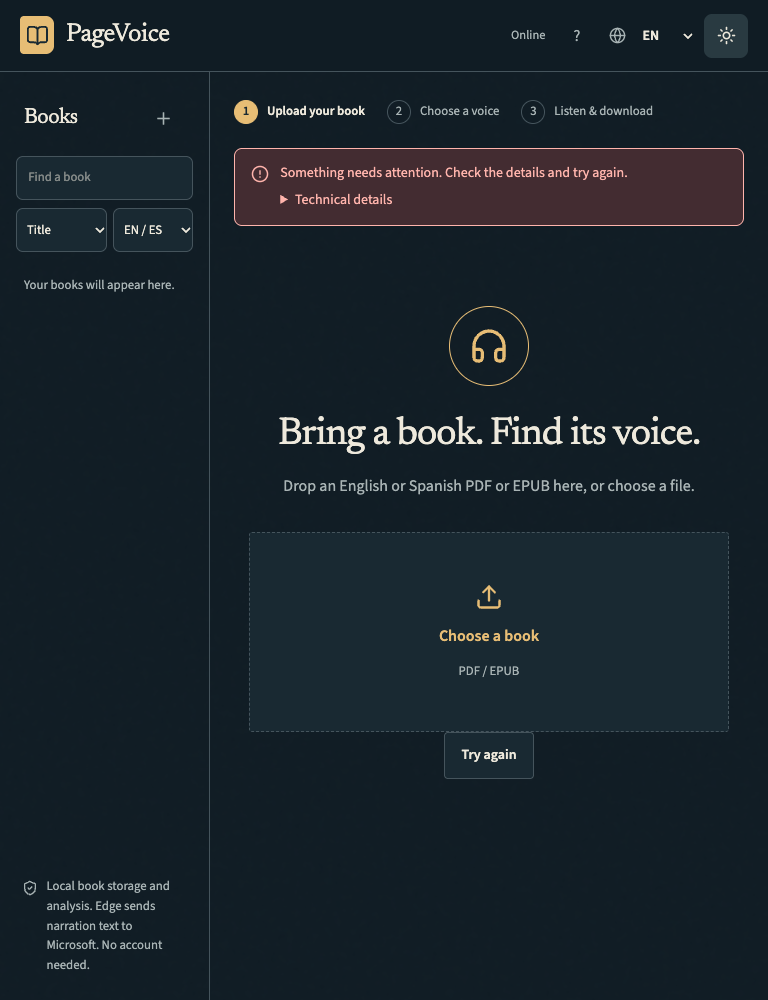 | 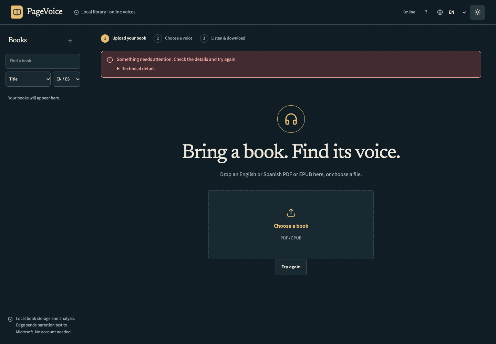 |
| After | 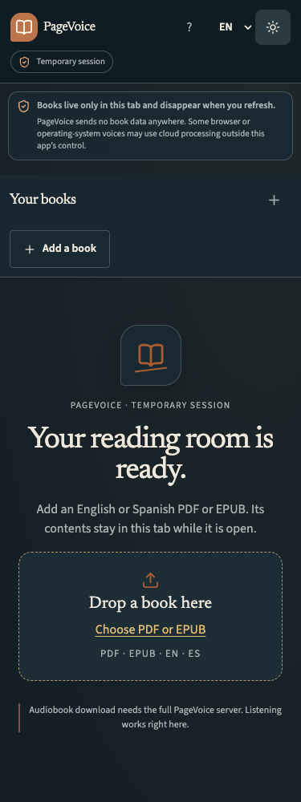 | 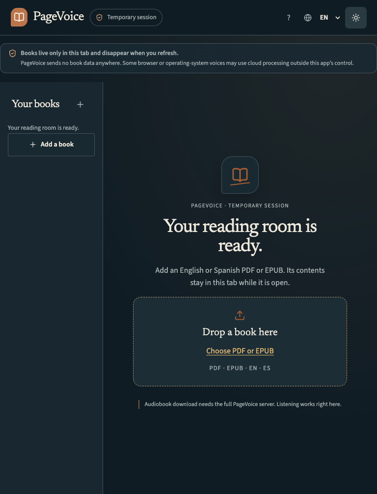 | 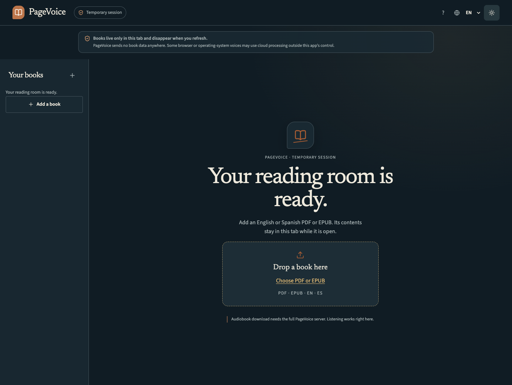 |

A populated 375 px reader capture from the Chromium smoke run is available at
[`reader-375-light.png`](screenshots/browser-mode/after/reader-375-light.png).

The screenshots document layout and theme behavior; they are not a substitute
for a Lighthouse or full WCAG audit. Those audits were not run for this change.
