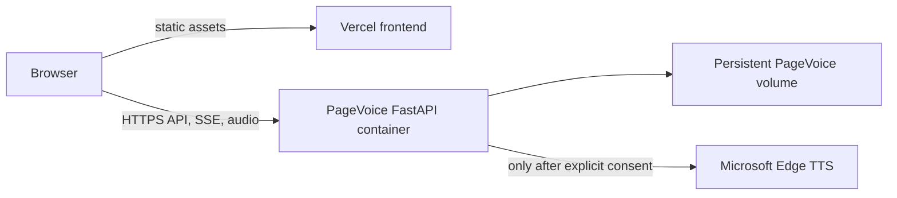
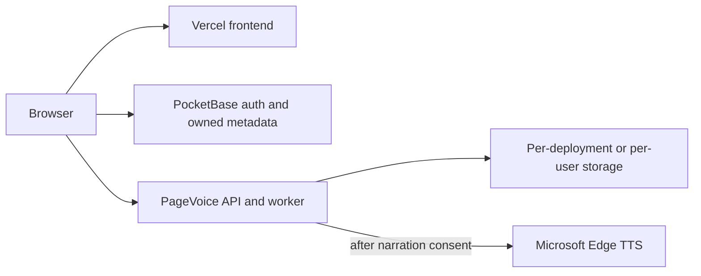

# PocketBase fit for PageVoice

Reviewed against PocketBase's official documentation on 2026-09-29. This is an
architecture assessment; it does not add PocketBase or change the current browser
privacy mode.

## Decision

PocketBase can be used as an optional identity and application-data service. It
cannot replace the PageVoice API and worker that parse books, synthesize Edge
speech, preserve resumable sentence jobs, and assemble M4B/MP3 files. For the
current single-library PageVoice product, PocketBase would duplicate storage and
access-control responsibilities already handled by the Python service. I do not
recommend adding it to the production path yet.

The shortest route to full Edge narration and export is the existing Vercel static
frontend plus the existing PageVoice Docker backend on a persistent container host.
Set `VITE_API_BASE_URL` to that backend's HTTPS origin and keep Edge's explicit
Microsoft consent check. The repo's [deployment guide](deployment.md) already
covers this route. When the variable is unset, the Vercel site remains temporary
browser mode: local parsing/search, speech synthesis from device voices, no export,
and no book data sent by PageVoice.

## What PocketBase fits

PocketBase is a self-hosted backend built around SQLite. It supplies REST APIs,
authentication, collection API rules, file storage and SSE-based realtime
subscriptions. A Vercel SPA can talk to a separately hosted PocketBase instance
through the official browser SDK. This could support user accounts, a per-user
library catalogue, synced preferences, and job-status notifications.

| PageVoice need | PocketBase fit | Consequence |
| --- | --- | --- |
| Accounts and per-user record access | Good | Auth collections and API rules can restrict records by owner. Every rule needs explicit tests before user data is enabled. |
| Book metadata and simple library records | Good | Store metadata and ownership in collections; the current backend already stores this for its single-library mode. |
| Realtime job status | Partial | PocketBase emits SSE for record changes. The Python worker still needs to own job execution, cancellation, recovery, sentence chunks, and progress semantics. |
| Book uploads up to PageVoice's 100 MB limit | Possible, with care | File fields default to roughly 5 MB; larger limits are configurable, but PocketBase warns that large file upload/serving can affect performance. This is not a substitute for measuring the current upload limit. |
| Edge TTS, FFmpeg, OCR, parsing, resume and sentence regeneration | No | These are implemented in Python and require the existing PageVoice runtime or another worker service. PocketBase does not provide a background job service. |
| Vercel serverless backend | No | PocketBase is a long-running self-hosted process with persistent writable data, not a Vercel Function. It needs another host and a persistent volume. |
| Horizontally scaled multi-node backend | Poor fit | PocketBase's own FAQ describes single-server/vertical scaling. Use a backend designed for multi-node operation if that becomes a requirement. |

PocketBase's server-side JavaScript runs in an embedded Goja VM, not Node.js. The
official docs explicitly distinguish it from Node/browser environments and say
PocketBase does not support cloud functions. Hooks can add application routes, but
they do not supply the separate Python/FFmpeg worker PageVoice requires.

## Recommended deployment shapes

### Current single-library deployment

This reuses the existing PageVoice job queue, access token, API, and filesystem
layout. It avoids introducing a second database, duplicate book metadata, account
flows, and a token-translation boundary. The hosted setup is currently a private
single-library deployment; the shared token grants access to the whole library.

### Optional multi-user deployment later

Only add PocketBase if PageVoice needs accounts and cross-device library sync. A
real multi-user design must make the worker enforce ownership too; hiding records
in the UI or checking ownership only in PocketBase would leave the Python API's
project IDs, audio endpoints, deletion, and SSE exposed. The browser must never
receive a superuser/API secret. Either the PageVoice API must validate the user's
auth securely, or a trusted service must translate the authenticated identity into
worker authorization. That integration is a separate security project, not a
front-end SDK installation.

If book files are uploaded to PocketBase, they become persistent server-side data.
That changes the current temporary-mode privacy promise. PageVoice would need a
separate, clear consent for server storage and deletion/retention controls; the
existing Edge consent must remain a distinct decision about sending narration text
to Microsoft. Protected file access and owner-only API rules must cover every
collection and file download.

## Production and operational risks

- PocketBase is self-hosted and needs a persistent volume, backups, restore tests,
  TLS, updates and monitoring. Its production guide recommends a single app server
  with persistent data and discusses local or S3-compatible backups.
- PocketBase currently warns that it is pre-1.0 and does not guarantee full
  backward compatibility; its docs do not recommend it for production-critical
  use unless operators are prepared to read release notes and perform manual
  migrations.
- A collection ACL mistake can expose a user's book records or protected files.
  API rules are the access boundary, so they need owner-isolation tests and must
  fail closed.
- Large source books and generated audiobook files can dominate storage and
  bandwidth. Putting all of them in PocketBase adds a second copy/retention system
  without removing PageVoice's worker volume. Source and output lifecycle must be
  defined before enabling uploads.
- PocketBase's realtime SSE can carry job-record changes, but it does not make
  job execution durable. The current PageVoice queue and its restart behavior
  should remain the source of truth unless a deliberate worker migration is built.
- Hosted mode stores book files, analysis, chunks and outputs on the configured
  server. Narration text goes to Microsoft only after the current explicit
  per-operation consent. Do not reuse the Edge consent as consent to cloud storage.

## Verification required before adopting it

1. Decide whether the product remains temporary/session-only or offers optional
   persistent server storage. These modes must stay visibly distinct.
2. Pick the backend owner and host. PocketBase itself is not a Vercel deployment.
3. Specify the user/account and retention model, including deletion of source,
   analysis, chunks, output files, trash and backups.
4. Threat-model user ownership across PocketBase records, the PageVoice API,
   progress streams, generated audio and direct file URLs.
5. Test upload limits, large-file memory/disk behavior, queue restart/resume, backups,
   restore, account deletion, and per-user isolation with two users.
6. Keep the existing Vercel browser mode working with no API requests when no
   backend URL is configured.

Until these decisions exist, use the existing PageVoice backend for full audiobook
features and keep PocketBase out of the runtime. Adding PocketBase alone would
create another service without making the current Vercel-only site capable of
Edge synthesis or audiobook export.

## Official sources

- [PocketBase overview](https://pocketbase.io/docs/) — feature set and pre-1.0
  compatibility/production warning.
- [PocketBase production guide](https://pocketbase.io/docs/going-to-production/)
  — self-hosting, persistent data and backup/restore.
- [PocketBase FAQ](https://pocketbase.io/faq/) — single-server scaling and no cloud
  functions.
- [PocketBase JavaScript extensions](https://pocketbase.io/docs/js-overview/) —
  embedded JS runtime caveats.
- [PocketBase API rules](https://pocketbase.io/docs/api-rules-and-filters/) —
  collection access controls and record filtering.
- [PocketBase file handling](https://pocketbase.io/docs/files-handling/) — upload
  behavior and default file-size guidance.
- [PocketBase realtime API](https://pocketbase.io/docs/api-realtime/) — SSE
  subscriptions for record changes.
